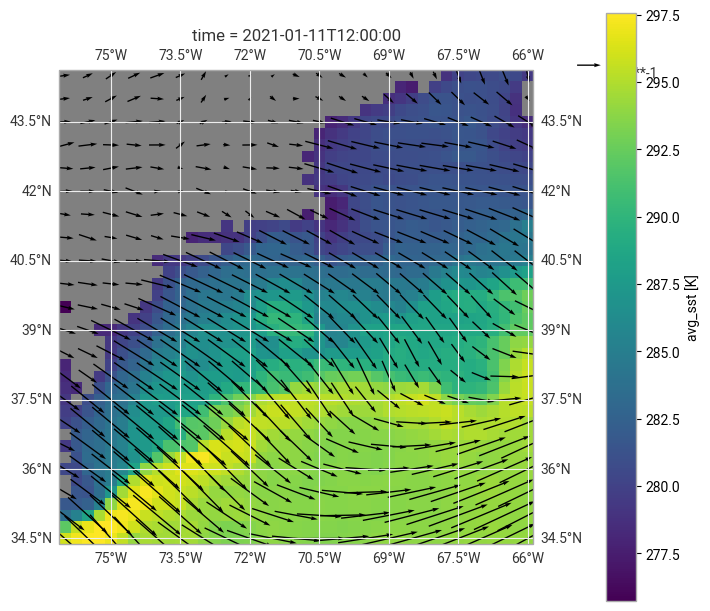
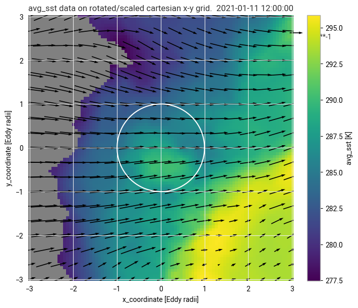

# eddytransform: Transformations for efficient eddy composites

Chris Roberts, Matthias Aengenheyster

This simple package extracts eddies from given coordinates (time and space) of mesoscale eddies, and assembles consistent eddies composites in an eddy-centric x-y coordinate system by scaling each eddy to its radius and rotating it such that the prevailing winds are along $y = 0$.

The package is at its core structured around `scipy.interpolate` and is meant to provide functions to efficiently sample (large) model or observational datasets.

The eddy tracks (providing space-time coordinates and eddy radii) need to be provided. Functions are provided to use tracks from observed AVISO sea surface height identified by `py-eddy-tracker` (Malcom Roberts) on ATOS and DKRZ's Levante system.

The fields to be composited may be on a regular lat-lon grid, or unstructured meshes (tested for IFS tco grids). In that case, the code understands a one-dimensial cell index called `value`, and coordinates `lat` and `lon` need to be contained in the dataset.

## Example:
See `eddytransform_example_short.ipynb` for a sample notebook using provided test data.
### Eddy in original geographical context

### Eddy scaled and rotated to eddy-centric coordinates

____________